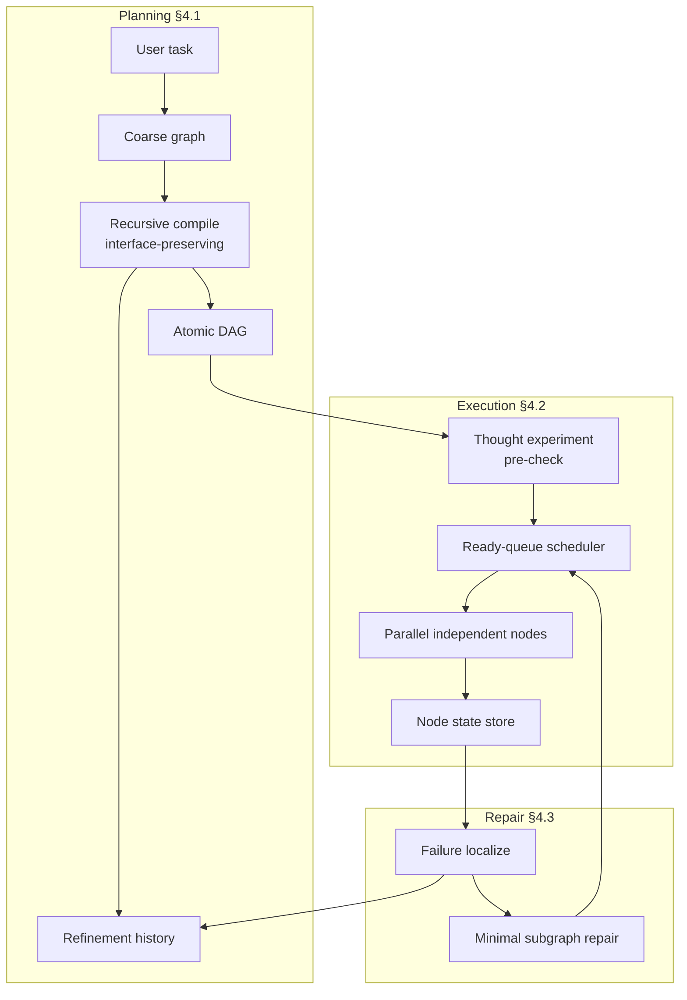
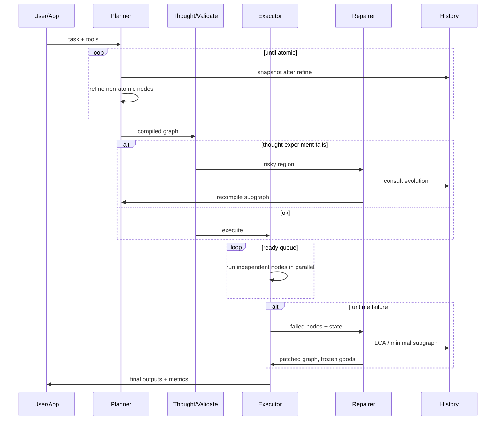

# atg-framework — Master Design & Architecture

**One-line vision:** A reusable, well-tested Atomic Task Graph control framework that recreates the paper’s reliability and efficiency benefits for LLM agents—especially on local / small open models—without claiming originality for the ATG method itself.

| Role | Path |
|------|------|
| **This document (what & how)** | `docs/ARCHITECTURE.md` |
| **Decisions / ADR log (why we chose X not Y)** | [`docs/DECISIONS.md`](DECISIONS.md) · index [`docs/adr/README.md`](adr/README.md) |
| **Open questions (parked decisions)** | [`docs/OPEN_QUESTIONS.md`](OPEN_QUESTIONS.md) |
| **Master backlog (next steps)** | [`docs/TODO.md`](TODO.md) |
| **Attribution** | [`docs/ATTRIBUTION.md`](ATTRIBUTION.md) · [`CITATION.cff`](../CITATION.cff) |

**Status:** Draft architecture for greenfield prototype (no package code yet).  
**Date:** 2026-07-11  
**Primary source:** Zhang et al., *Atomic Task Graph…*, arXiv:2607.01942 (2026). Cite as `zhang2026atg`.

---

## 1. Overview

Existing agent loops (ReAct-style) keep subtask **I/O dependencies implicit in growing text**. That makes verified intermediate results hard to reuse, failures hard to localize, and independent work hard to run in parallel. Zhang et al. (2026) propose **Atomic Task Graph (ATG)**: an explicit DAG of atomic tool-use nodes that unifies planning and execution.

This repository reimplements those **goals and control benefits** as a Python framework suitable for local LLM stacks (Ollama, LiteLLM, DSPy, LangGraph adapters), with testing and observability first-class—not a paper reproduction of ALFWorld/WebShop/ScienceWorld harnesses on day one.



---

## 2. Background & paper method map

### 2.1 Problem the paper solves

| Failure mode of linear agents | ATG response |
|-------------------------------|--------------|
| Dependencies buried in text | Explicit edges \(v_j \to v_k\) = output→input |
| Cascading errors; global replan | Localize via refinement history; freeze good regions |
| Sequential-only execution | Parallel ready nodes |
| Hallucinated late actions | Localized node context + pre-execution thought experiment |
| Hard to reuse verified work | Node-level state + frozen validated subgraphs |

### 2.2 Paper definitions (implement these concepts)

| Concept | Paper meaning | Framework sketch |
|---------|---------------|------------------|
| **Task** \(x\) | User problem with acceptable outputs \(\mathcal{Y}_x\) | `TaskSpec` |
| **Tool** \(f_k: I \to O\) | Atomic I/O unit (API, code, env action) | `Tool` registry + callables |
| **Node** \(v = (i, f, o)\) | One tool invocation | `TaskNode` |
| **Edge** | Output of \(v_j\) feeds input of \(v_k\) | dependency list / edge table |
| **DAG** \(G=(V,E)\) | Executable plan | `TaskGraph` |
| **Refinement history** | Sequence of graphs coarse→fine | `GraphHistory` |
| **Interface preservation** | Subgraph of parent keeps same external I/O | compile invariant |
| **Thought experiment** | Cheap internal pre-check before env cost | `PlanValidator` / simulator |
| **Minimal subgraph repair** | LCA of failed nodes in history; repair only that region | `Repairer` |

### 2.3 Three stages to recreate (benefits)

1. **Interface-preserving recursive graph compilation** (§4.1)  
   - **Benefit:** compositional plans; traceable evolution; localized context per node → fewer hallucinations.  
2. **Dependency-aware execution** (§4.2)  
   - **Benefit:** parallel independent branches; fewer effective steps; clear node state.  
3. **Minimal necessary subgraph repair** (§4.3)  
   - **Benefit:** don’t throw away good work; lower recovery cost vs full replan.

### 2.4 Paper evaluation (context only)

| Item | Paper | Our near-term stance |
|------|-------|----------------------|
| Benchmarks | ALFWorld, WebShop, ScienceWorld | Optional later; start with **synthetic DAGs + mock tools** |
| Metrics | avg reward, steps, hallucinated-action rate | success, steps/wall time, repair count, frozen-reuse count |
| Backbones | 7B–8B open models + GPT baselines | Pluggable via LiteLLM/Ollama; **modern defaults** (below) |
| Training | Inference-only, no fine-tune | Same |

---

## 3. Goals & non-goals

### 3.1 Primary goals

1. **Faithful control semantics** for the three ATG stages (not line-for-line paper code; paper has no public official SDK).
2. **Observable graphs** — every plan/execute/repair step inspectable (JSON dumps, optional viz).
3. **Testability** — deterministic mock LLM/tools; property tests for DAG invariants; failure-injection harness.
4. **Local-LLM friendly** — small models, high latency, need structure more than raw scale.
5. **Composable** — core independent of any one agent framework; thin adapters later (DSPy, LangGraph).
6. **Correct attribution** — Zhang et al. (2026) for method; see ATTRIBUTION policy.

### 3.2 Non-goals (MVP and near-term)

- Official reproduction of paper tables on ALFWorld/WebShop/ScienceWorld.
- Training / fine-tuning agents.
- Multi-agent social frameworks (CAMEL-style) as core.
- Claiming this repo “proposes ATG” or is the authors’ official implementation.
- Heavy UI product; CLI + library first.

### 3.3 Success criteria (MVP)

A developer can:

1. Register a few tools and a mock or real LLM.
2. Compile a multi-step task into a DAG with ≥1 parallelizable branch.
3. Execute with dependency-aware scheduling (parallel when independent).
4. Inject a failure and observe **localized** re-plan/repair that **does not** re-run frozen successful nodes.
5. Run `pytest` green with mocks (no GPU required).

---

## 4. Outdated or brittle paper details (modernize here)

The paper is method-primary (2026-07). Several **experimental stack choices age quickly**. This section is the living modernization guide—update when defaults change; do **not** treat paper checkpoint names as product requirements.

### 4.1 Backbone models (paper vs recommended defaults)

| Paper baseline | Notes | Modernization guidance (2026-07) |
|----------------|-------|----------------------------------|
| Mistral-7B-Instruct-**v0.2** | Early Mistral instruct | Prefer current Mistral small/instruct lines or Ollama tags the user already runs |
| Gemma-**1.1**-7B-it | Gemma 1.x era | Prefer **Gemma 2/3** instruct-class tags if used |
| Meta-**Llama-3**-8B-Instruct | Superseded by 3.1+ / later Llama families | Prefer **Llama 3.1+ / current 8B-class** instruct models |
| GPT-**3.5**-Turbo, **GPT-4** | Strong proprietary baselines in paper | Optional: GPT-4o / current OpenAI or xAI Grok via LiteLLM—for *comparison*, not core dependency |
| “7B–8B only” narrative | Valid for paper claim | Keep small-model focus; allow larger models without code forks |

**Decision principle:** Core must be **model-agnostic** (chat completions + structured output). Pin example model IDs in config/examples, not in library constants.

### 4.2 Environments & benchmarks

| Paper | Caveat | Our path |
|-------|--------|----------|
| ALFWorld / WebShop / ScienceWorld | Heavy env install; research harnesses; versions drift | Phase 3+ optional adapters; not MVP |
| Text-only interactive envs | Paper limitation §7 | Same initially; tools can later wrap multimodal |

### 4.3 Baselines named in paper

ReAct, Reflexion, ToT, Plan-over-Graph (PoG), CAMEL remain **conceptually** relevant. We do **not** reimplement all baselines for MVP. Optional: thin ReAct baseline in `examples/` for A/B demos.

### 4.4 Implementation surface the paper leaves underspecified

Paper does not ship production package versions. Underspecified for engineering (tracked as OQs):

- Exact prompt templates and structured-output schema for compilation
- Thought-experiment procedure (rules vs LLM judge)
- Parallel runtime (threads vs async)
- Persistence format for history
- Tool schema standard

### 4.5 Methods we treat as still current

- Explicit DAG over linear trajectory for control
- Interface-preserving recursive refinement
- Ready-queue / dependency-aware parallel execution
- History-backed minimal repair (vs full replan)
- Training-free control around frozen base models

### 4.6 Methods / habits to avoid copying blindly

| Paper-era habit | Risk | Prefer |
|-----------------|------|--------|
| Single giant prompt with full trajectory | Context bloat / hallucinations | Per-node localized context (paper’s own point) |
| Global replan on any failure | Cost, lost verified work | Minimal subgraph repair |
| Hard-coding 2024 model IDs | Bitrot | Config + LiteLLM model strings |
| Benchmark-only design | Unusable library | Library-first, benchmarks later |
| Equating “graph search” (ToT/GoT) with **executable dependency graphs** | Wrong abstraction | ATG: graph is **execution substrate**, not only planning search |

---

## 5. Proposed design

### 5.1 Package layout (target)

```
src/atg/                  # installable package (Decision 0008)
  __init__.py             # version + attribution blurb
  types.py                # TaskSpec, NodeId, NodeStatus, interfaces
  graph.py                # TaskGraph, edges, topo, freeze/mark
  history.py              # refinement snapshots / events
  tools.py                # Tool registry, schemas
  planner.py              # recursive compilation
  executor.py             # ready-queue + parallel run
  thought.py              # pre-execution checks
  repair.py               # localize + minimal repair
  llm.py                  # thin LLM port (LiteLLM / protocol)
  validation.py           # DAG + interface checks
  metrics.py              # steps, parallel width, repair stats
  integrations/           # optional extras
    dspy_adapter.py
    langgraph_adapter.py
examples/
tests/
docs/                     # this system
pyproject.toml            # uv + extras (Decision 0008)
```

**Layering rule:** `graph` / `types` have **no** LLM dependency. Planner/repair depend on `llm` protocol. Integrations depend on core, never the reverse.

### 5.2 Core data model (binding + sketch)

| Concern | Binding |
|---------|---------|
| Graph topology & algorithms | **Decision 0005** — stdlib-only (no NetworkX in core) |
| Node / result / DTO modeling | **Decision 0006** — Pydantic v2 public models |
| Tool / atomic definition | **Decision 0007** — OpenAI-style schema + callable; abstract non-atomic; `refine=False`; literals+`$ref` |

```python
# Sketch — field names may evolve in PRs; Pydantic is the standard (Decision 0006).
from pydantic import BaseModel, Field
from enum import Enum
from typing import Any

class NodeStatus(str, Enum):
    pending = "pending"
    ready = "ready"
    running = "running"
    done = "done"
    failed = "failed"
    frozen = "frozen"

class TaskNode(BaseModel):
    id: str
    name: str
    tool_name: str | None = None   # None / unset ⇒ non-atomic until compile finishes (see OQ-0004)
    inputs: dict[str, Any] = Field(default_factory=dict)  # literals or refs to upstream
    outputs: dict[str, Any] | None = None
    status: NodeStatus = NodeStatus.pending
    parent_id: str | None = None   # refinement parent for history LCA
    metadata: dict[str, Any] = Field(default_factory=dict)

# TaskGraph: stdlib container (Decision 0005) holding TaskNode values (Decision 0006)
# GraphSnapshot / GraphHistory: full immutable snapshots per step (Decision 0009)
```

### 5.3 Control loop



### 5.4 Interfaces (ports)

```python
class LLMClient(Protocol):
    def complete(self, messages: list[dict], **kwargs) -> str: ...
    def complete_structured(self, messages: list[dict], schema: type) -> Any: ...

class Tool(Protocol):
    name: str
    description: str
    def run(self, **kwargs) -> Any: ...
```

MVP LLM path: **LiteLLM** (covers Ollama, OpenAI-compatible, etc.) behind `LLMClient`. No hard dependency on a single vendor SDK in core if avoidable (`litellm` as declared dependency is OK).

### 5.5 Testing architecture (first-class)

| Layer | What |
|-------|------|
| Unit | topo sort, freeze, LCA, interface-preservation checks |
| Planner | mock LLM returns fixed JSON decompositions |
| Executor | mock tools with delays; assert parallel width ≥ 2 |
| Repair | fail tool once; assert frozen nodes not re-called |
| Property | Hypothesis: random DAGs remain acyclic under compile stubs |
| Optional e2e | real Ollama model, marked `@pytest.mark.integration` |

### 5.6 Observability

- Structured log events: `node_started`, `node_finished`, `repair_started`, `thought_reject`
- Metrics object: `total_steps`, `wall_time`, `max_parallel`, `repairs`, `nodes_frozen_reused`
- `graph.to_dict()` / optional Graphviz or Mermaid export for demos

### 5.7 Security & privacy

- Tools may have side effects: default **allowlist registry** (no arbitrary shell unless user registers it).
- Don’t log secrets from tool outputs by default (redaction hook later).
- No credentials in repo; model API keys via env (`OPENAI_API_KEY`, `OLLAMA_HOST`, etc.).

---

## 6. Alternatives considered (project-level)

| Approach | Pros | Cons | Verdict |
|----------|------|------|---------|
| **A. Custom ATG core + thin adapters** | Faithful to paper; testable; not trapped in one framework | More initial design | **Preferred** (see Decision 0002) |
| **B. LangGraph-first** | Ecosystem, persistence | Graph model may not match refinement history / minimal repair cleanly | Adapter later, not core |
| **C. DSPy-only modules** | Great for prompts | Weaker as general execution substrate | Optional integration |
| **D. Reproduce paper envs first** | Scientific parity | Slow, brittle, poor library UX | Defer |

---

## 7. Rollout / implementation path

Aligned with [`docs/TODO.md`](TODO.md). Each phase ends with a verifiable gate.

| Phase | Deliverable | Gate |
|-------|-------------|------|
| **0. Docs system** | ARCHITECTURE, DECISIONS, OPEN_QUESTIONS, TODO | You are here |
| **1. Skeleton package** | `atg/` types + graph + tests for DAG ops | `pytest` green, no LLM |
| **2. Executor** | ready-queue + parallel mock tools | parallel branch test passes |
| **3. Planner (stub→LLM)** | recursive compile with mock structured output | multi-level graph from fixture |
| **4. Thought + repair** | pre-check stub + minimal repair with freeze | failure injection test |
| **5. Real LLM path** | LiteLLM/Ollama example | documented example runs |
| **6. Integrations & polish** | DSPy/LangGraph extras, metrics, packaging | optional extras install |

### PR-sized slices (suggested)

1. **chore: docs system** — this document set  
2. **feat: graph core** — types, TaskGraph, history snapshots, tests  
3. **feat: executor ready-queue** — parallel mock tools  
4. **feat: planner mock compile** — interface-preserving refine loop  
5. **feat: thought + repair** — freeze + LCA subgraph  
6. **feat: llm port + example** — LiteLLM + toy task  
7. **feat: packaging** — pyproject, extras, CI pytest  

---

## 8. Key decisions (summary)

Binding detail lives in [`docs/DECISIONS.md`](DECISIONS.md).

| ID | Summary |
|----|---------|
| **0001** | Doc system: ARCHITECTURE + DECISIONS + OPEN_QUESTIONS + TODO + contextual OQ links |
| **0002** | Custom ATG core; LangGraph/DSPy as adapters, not foundation |
| **0003** | Model-agnostic LLM port; no paper model IDs in core |
| **0004** | MVP = synthetic tools + mocks; paper benchmarks deferred |
| **0005** | Stdlib-only graph core (no NetworkX); revisit if domain evidence changes |
| **0006** | Pydantic v2 for public node/result models; revisit if zero-dep policy |
| **0007** | Tools: OpenAI-style schema + callable; atomicity, depth 6, `$ref`, `refine=False` |
| **0008** | Packaging: `src/atg/`, uv + pyproject, optional extras |
| **0009** | Graph history: full immutable snapshots each compile/repair step |
| **0010** | Parallel runner: pluggable port, ThreadPoolExecutor default |

Open architectural choices (ready-queue detail, planner prompts, repair LCA, license, etc.) stay in [`docs/OPEN_QUESTIONS.md`](OPEN_QUESTIONS.md) until promoted to ADR.

---

## 9. Risks

| Risk | Severity | Mitigation |
|------|----------|------------|
| Over-faithful paper prompts without tests | High | Mock-first; golden JSON fixtures |
| Premature framework coupling | High | Decision 0002; core purity tests |
| Scope creep into full benchmark suite | Med | Non-goals; Phase gates |
| Repair LCA wrong → silent incorrect reuse | High | Explicit freeze flags + tests |
| Structured output flaky on small models | Med | Schema simplify; retry; validation layer |

---

## 10. References

- Zhang et al. (2026). Atomic Task Graph… arXiv:2607.01942. DOI [10.48550/arXiv.2607.01942](https://doi.org/10.48550/arXiv.2607.01942). BibTeX: `docs/citations.bib` (`zhang2026atg`).
- `docs/ATTRIBUTION.md` — idea inventory and credit rules.
- Related control paradigms (baselines, not dependencies): ReAct, Reflexion, Tree-of-Thoughts, Plan-over-Graph, Graph-of-Thoughts.
- Catalog note: [local-llm-dev-tools](https://github.com/themark-net/local-llm-dev-tools) (ATG feasibility / methodology notes).

---

## Document maintenance

- **Architecture changes** → update this file in the same PR as code boundary changes.  
- **Binding choices** → ADR in `docs/DECISIONS.md` (never only chat).  
- **Parked choices** → `docs/OPEN_QUESTIONS.md`; link from TODO items and, when useful, from module stubs.  
- **Paper modernization** → revise §4 when defaults or ecosystem shift.
